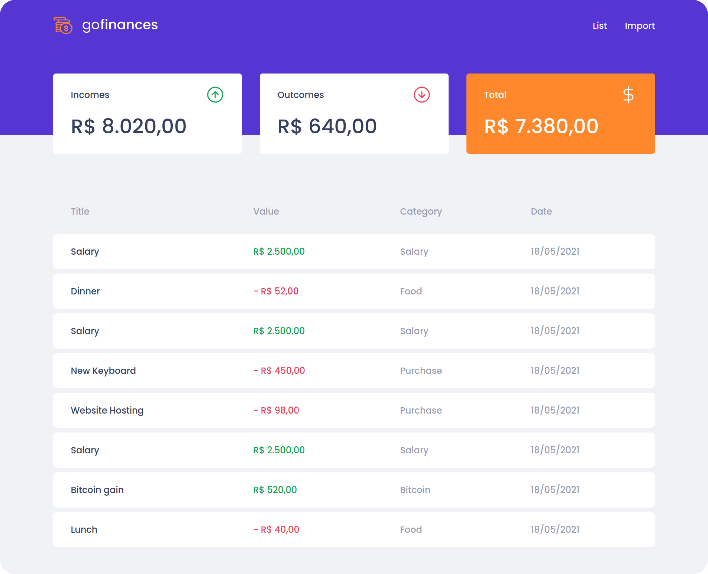
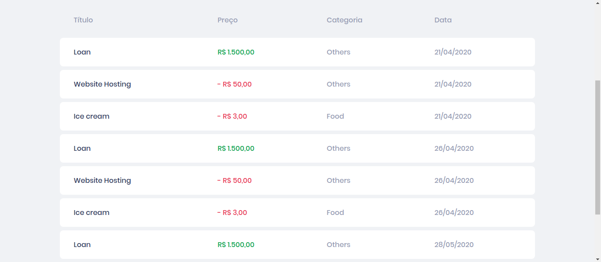
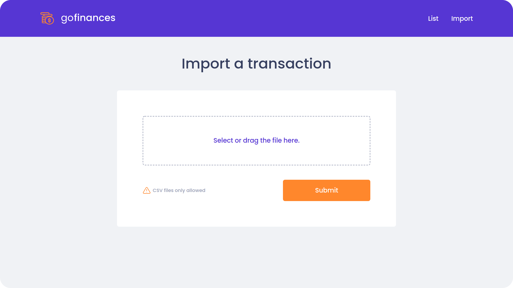

<p align="center">
  
</p>

<h1 align="center" style="text-align: center;">GoFinances</h1>

<p align="center">
	<a href="https://github.com/LuizFerK">
		
	</a>
	<a href="#">
		
	</a>
	<a href="hhttps://github.com/LuizFerK/GoFinances/stargazers">
		
	</a>
	<a href="https://github.com/LuizFerK/GoFinances/network/members">
		
	</a>
	<a href="https://github.com/LuizFerK/GoFinances/graphs/contributors">
		
	</a>
</p>

<p align="center">
	<b>Help yourself to controll your daily transactions and save money!</b><br />
	<span>Created with Node.js, ReactJS, all with Typescript.</span><br />
	<sub>Made with ❤️</sub>
</p>

<br />





<br />

<h1>Technologies used in this application:<h1>

### Node.js (backend)
- Express
- TypeORM
- Multer
### React.js (WebClient)
- Axios
- Styled Components
- React Dropzone

<h1>Get started</h1>

### !!! Requirements
- Node
- Yarn
- Postgres database

To start the aplications in your device, first, clone this repository in a new folder. After that, with your terminal, open the folders ```backend```  and ```frontend``` and run ```yarn``` in each one. After the dependeces instalation, run ```yarn dev:server``` on ```backend``` folder and ```yarn start``` on ```frontend``` folder.

A new tab will be open in your browser with the application.
