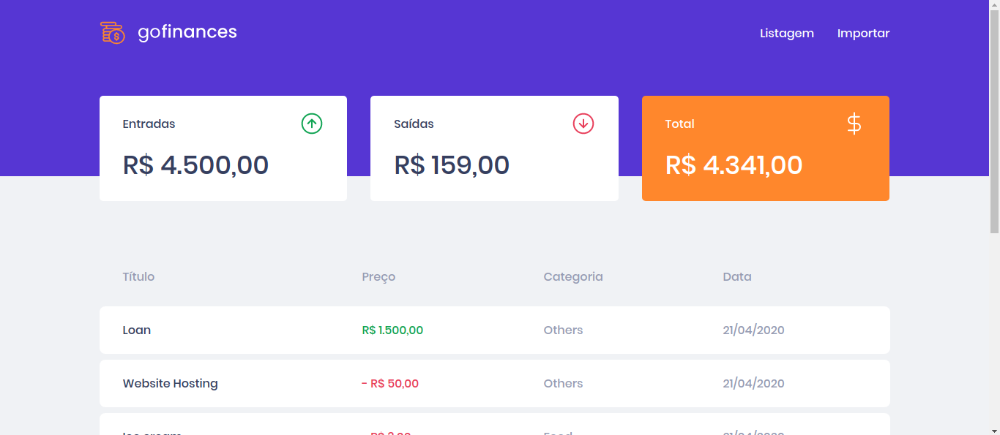
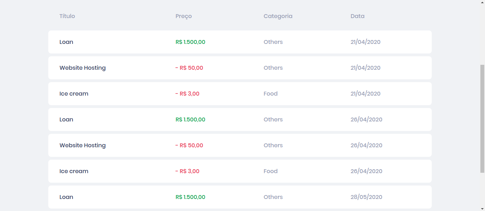
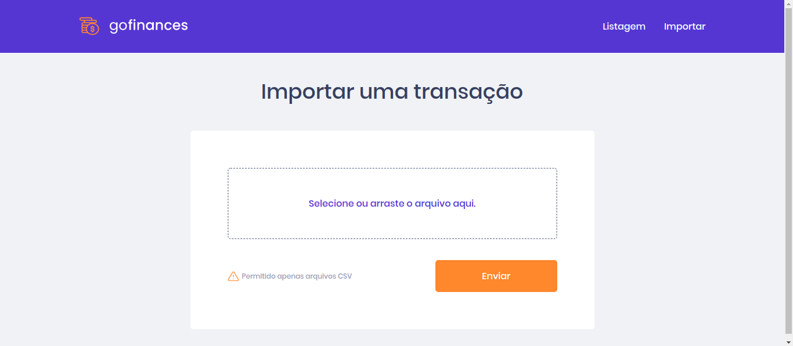

<h1 align="center">
  GoFinances
  <hr />
  
  
  
  <hr />
	
</h1>
<p align="center">
	The application has been created to help people controll their own daily transaction and save money. Created with Node.js ReactJS, all with Typescript.
</p>
<h1>Technologies used in this application:<h2>

### Node.js (backend)
- Express
- TypeORM
- Multer
### React.js (WebClient)
- Axios
- Styled Components
- React Dropzone

<h1>Get started</h1>

### !!! Requirements
- Node
- Yarn
- Postgres database

To start the aplications in your device, first, clone this repository in a new folder. After that, with your terminal, open the folders ```backend```  and ```frontend``` and run ```yarn``` in each one. After the dependeces instalation, run ```yarn dev:server``` on ```backend``` folder and ```yarn start``` on ```frontend``` folder.

A new tab will be open in your browser with the application.
